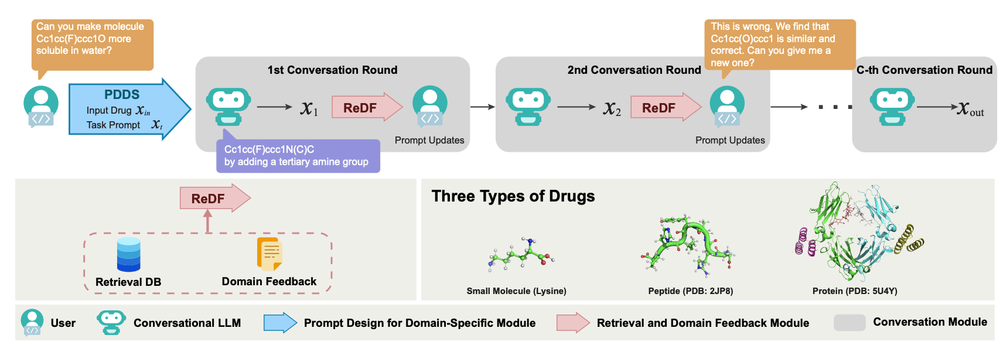

# ChatGPT-powered Conversational Drug Editing Using Retrieval and Domain Feedback

**ICLR 2024**

Authors: Shengchao Liu<sup>+</sup>, Jiongxiao Wang<sup>+</sup>, Yijin Yang, Chengpeng Wang, Ling Liu, Hongyu Guo<sup>\*</sup>, Chaowei Xiao<sup>\*</sup>

<sup>+</sup> Equal contribution<br>
<sup>\*</sup> Equal advising

[[Paper](https://openreview.net/forum?id=yRrPfKyJQ2)]
[[Project Page](https://chao1224.github.io/ChatDrug)]
[[ArXiv](https://arxiv.org/abs/2305.18090)]

<p align="center">
   
</p>


ChatDrug is for conversational drug editing, and three types of drugs are considered:
- Small Molecules
- Peptides
- Proteins
<p align="left">
   
</p>

## Environment

Setup the anaconda (skip this if you already have conda)
 ```bash
wget https://repo.continuum.io/archive/Anaconda3-2019.10-Linux-x86_64.sh
bash Anaconda3-2019.10-Linux-x86_64.sh -b
export PATH=$PWD/anaconda3/bin:$PATH
```

Then download the required python packages:
```bash
conda create -n ChatDrug python=3.7
conda activate ChatDrug
conda install -y -c rdkit rdkit
conda install -y numpy networkx scikit-learn
conda install -y -c conda-forge -c pytorch pytorch=1.9.1

pip install tensorflow
pip install mhcflurry
pip install levenshtein

pip install transformers
pip install lmdb
pip install seqeval
pip install openai

pip install -e .
```

## Dataset

We provide the dataset in [this link](https://huggingface.co/datasets/chao1224/ChatDrug_data). You can manually download and move to the `data` folder or using the following python script.
```
from huggingface_hub import snapshot_download

snapshot_download(repo_id="chao1224/ChatDrug_data", repo_type="dataset", local_dir="data", local_dir_use_symlinks=False, ignore_patterns=["README.md"])
```
Please give credits to the original papers. For more details of dataset, please check the [data folder](./data).

## Evaluation

The evaluation metrics for three editing tasks are below:
| Drug Type | Evaluation |
| -- | -- |
| Small Molecule | RDKit (`conda install -y -c rdkit rdkit`)|
| Peptide | [MHCFlurry](https://github.com/openvax/mhcflurry)|
| Protein | [ProteinDT paper](https://arxiv.org/abs/2302.04611), [checkpoints](https://huggingface.co/chao1224/ProteinCLAP_pretrain_EBM_NCE_downstream_property_prediction) |

For evaluation on peptides and proteins, please read the following instructions:
- For peptides (MHCFlurry), please run the following bash commands:
```
> pip install mhcflurry
> mhcflurry-downloads fetch models_class1_presentation
> mhcflurry-downloads path models_class1_presentation
$PATH
> mv $PATH data/peptide/models_class1_presentation
```
- For proteins (ProteinDT / ProteinCLAP), please run the following python script:
```
from huggingface_hub import hf_hub_download

hf_hub_download(
  repo_id="chao1224/ProteinCLAP_pretrain_EBM_NCE_downstream_property_prediction",
  repo_type="model",
  filename="pytorch_model_ss3.bin",
  cache_dir="data/protein")
```
Please give credits to the original papers. For more details of evaluation, please check the [data folder](./data).

## Prompt for Drug Editing

All the task prompts are defined in `ChatDrug/task_and_evaluation`. you can also find it on [the hugging face link](https://huggingface.co/datasets/chao1224/ChatDrug_prompt).

## Usage

Please provide your OpenAI API Key in `ChatDrug/task_and_evaluation/Conversational_LLMs_utils.py`

To use ChatDrug, please use the following command:
```
python main_ChatDrug.py --task task_id --log_file results/ChatDrug.log --record_file results/ChatDrug.json --C 2
```
Results will be saved in `results/`.

For protein editing tasks, multiple evaluation times in retrieval process would consume a lot of time. Thus, we provide a fast version of conversation setting. Running the following command to implement accelerate ChatDrug for protein editing tasks:
```
python main_ChatDrug.py --task task_id --log_file results/ChatDrug_fast_protein.log --record_file results/ChatDrug_fast_protein.json --C 2 --fast_protein
```

We also provide code for In-Context Learning setting:
```
python main_InContext.py --task task_id --log_file results/InContext.log --record_file results/InContext.json
```


## Cite Us
Feel free to cite this work if you find it useful to you!

```
@inproceedings{liu2024chatdrug,
    title={Conversational Drug Editing Using Retrieval and Domain Feedback},
    author={Shengchao Liu, Jiongxiao Wang, Yijin Yang, Chengpeng Wang, Ling Liu, Hongyu Guo, Chaowei Xiao},
    booktitle={The Twelfth International Conference on Learning Representations},
    year={2024},
    url={https://openreview.net/forum?id=yRrPfKyJQ2}
}
```
